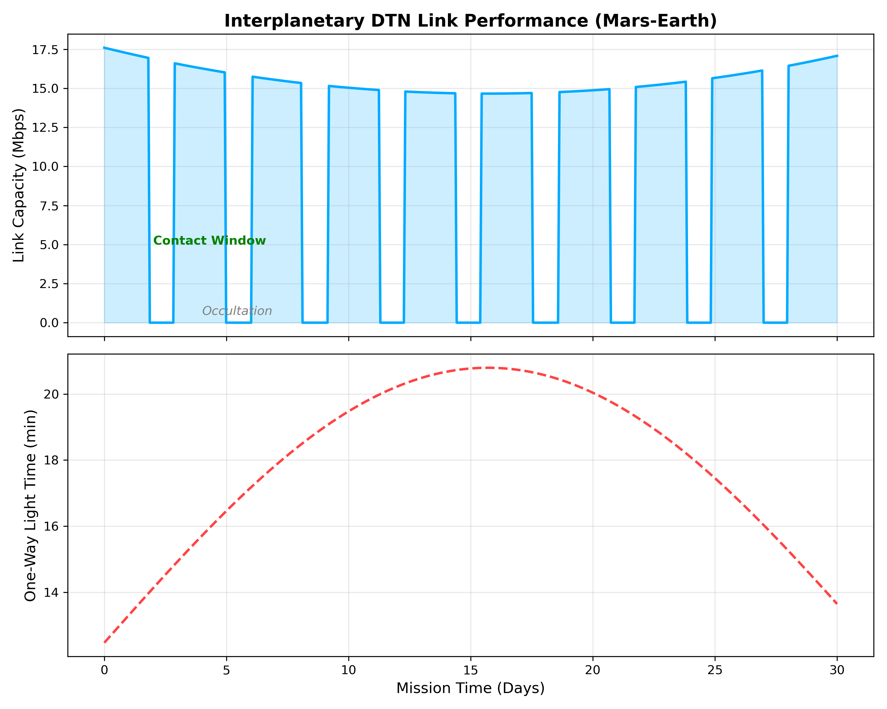
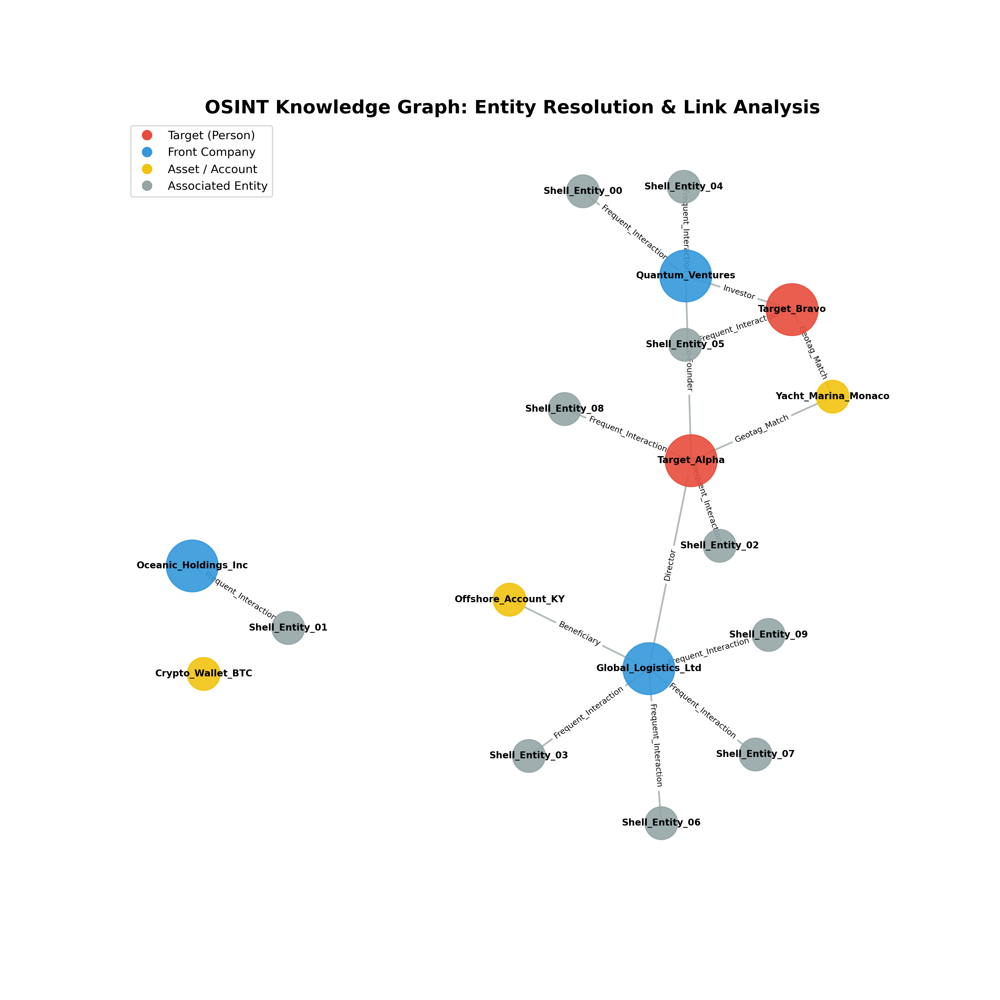
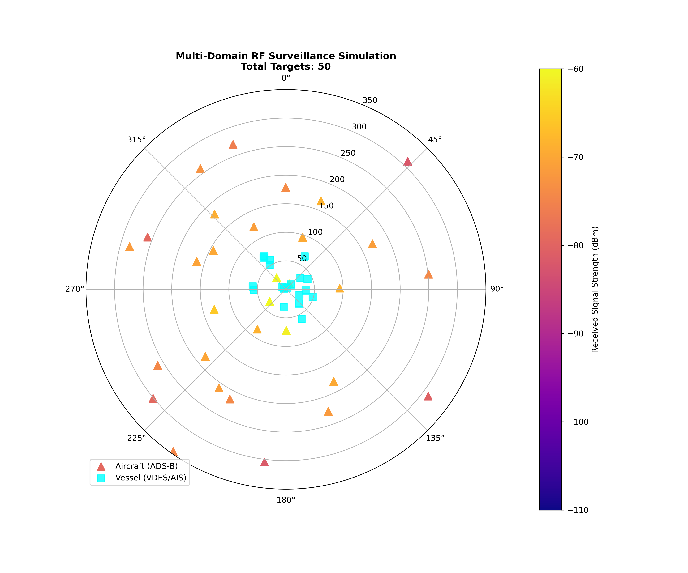
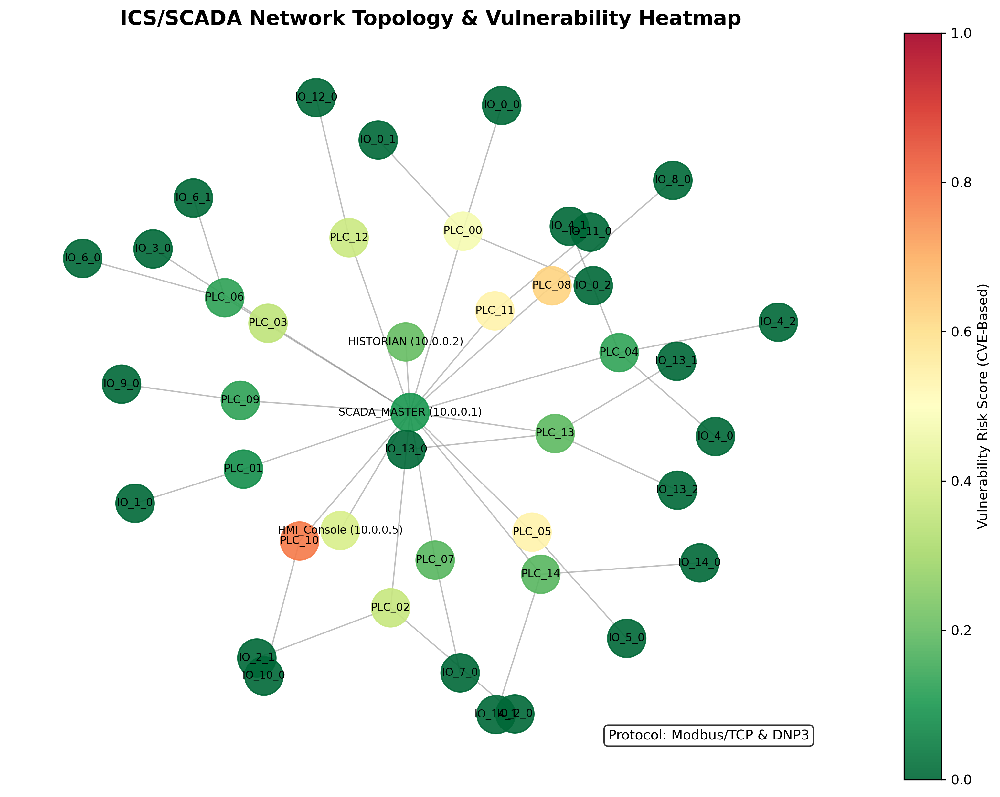
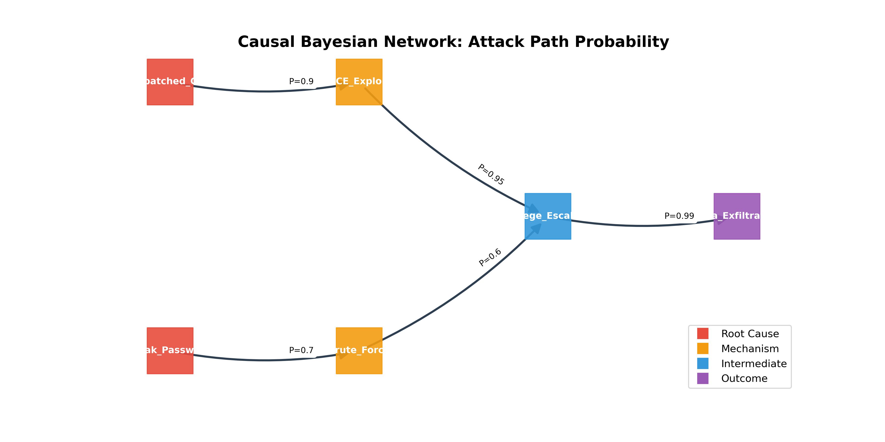
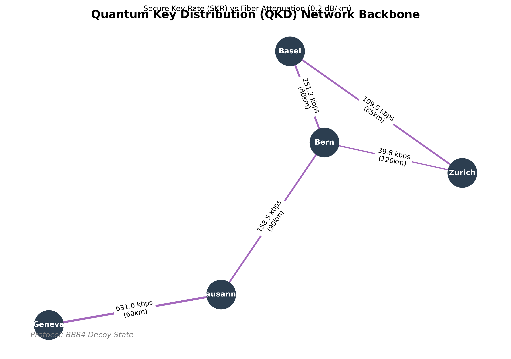
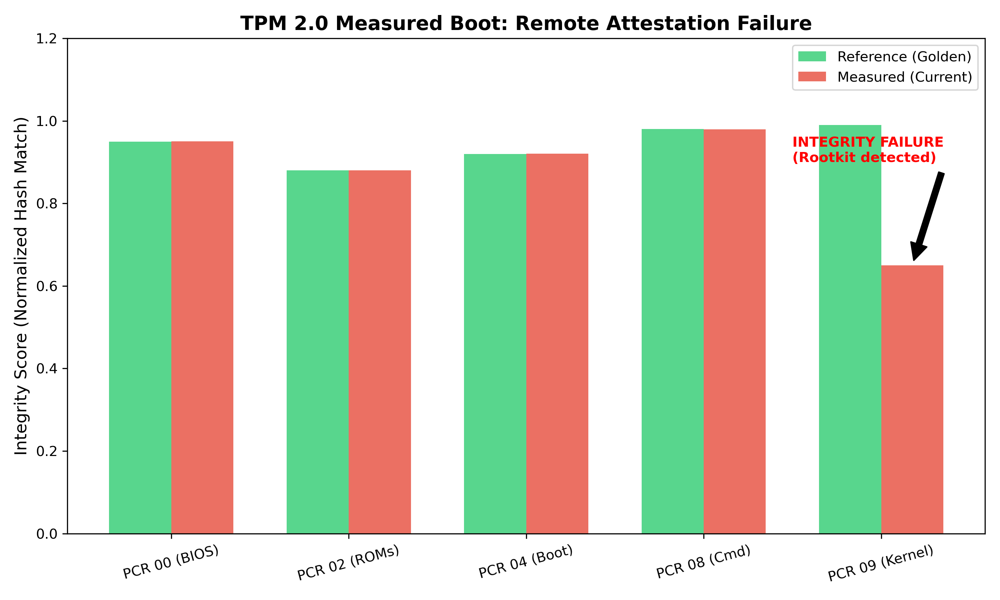
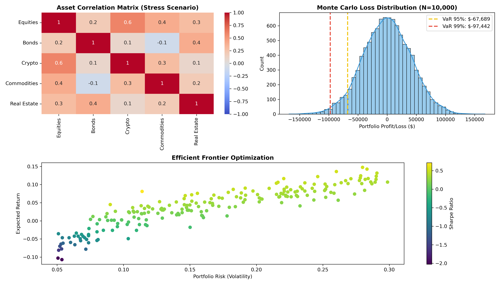
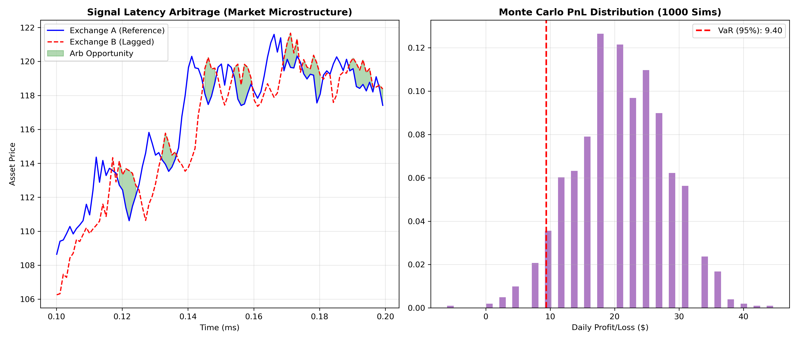
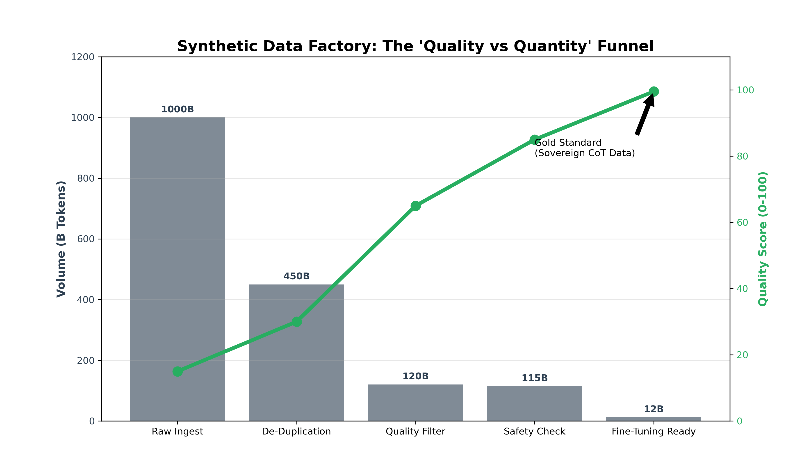

## DAVID TOM FOSS // ADVANCED RESEARCH
## High-Assurance Systems for the Post-Quantum Era

[](https://www.linkedin.com/in/david-tom-foss)
[](mailto:contact@davidtomfoss.com)
[](./04_Technical_Reports/)
[](https://papers.ssrn.com/sol3/papers.cfm?abstract_id=5675042)
[](LICENSE)

> **"Bridging the capabilities of an R&D Lab with the agility of a Solo Founder."**

This repository is the **Engineering Portfolio** of David Tom Foss. It contains **Reference Implementations**, **Simulation Environments**, and **Technical Reports** that demonstrate capability in delivering high-complexity architectures (AI Security, Neurotech, Autonomous Systems).

---

## 🏆 Published Research (Peer-Reviewed)
**[Propellant-Less Orbital Maneuvering System with Superconducting Magnet Control](https://papers.ssrn.com/sol3/papers.cfm?abstract_id=5675042)**  
*David Tom Foss (2025)*  
**Abstract**: A revolutionary system enabling theoretically unlimited satellite lifetimes via HTS magnetic coils and PINNs.  
**DOI**: `10.2139/ssrn.5675042` | **Status**: Published on SSRN

---

## 🔬 Research Domains & Reference Implementations

The portfolio is organized into **5 Strategic Clusters** containing **16 Reference Implementations**. Each module provides a standalone scientific simulation.

### 🌌 Domain 1: Space & Satellite Systems
*   **[Interplanetary Network Simulator](./03_Reference_Implementations/Interplanetary_Network_Analyzer)**: CCSDS Bundle Protocol modeling for high-latency Mars-Earth links.
    <br>
*   **[UAV Landing Control](./03_Reference_Implementations/FH-SS_UAV_Simulation)**: Physics-Informed Neural Networks (PINNs) for autonomous landing in GPS-denied zones.
    <br>

### 🛡️ Domain 2: Defense & Intelligence (OSINT)
*   **[Autonomous OSINT Platform](./03_Reference_Implementations/Autonomous_OSINT_Platform)**: Entity Resolution using Force-Directed Graph Clustering.
    <br>
*   **[Maritime & Aero Tracker](./03_Reference_Implementations/Maritime_Aero_Tracker)**: ADS-B/VDES Surveillance Simulation using Friis Transmission Equation.
    <br>
*   **[Cyberdefense Runtime](./03_Reference_Implementations/Cyberdefense_Runtime)**: Self-healing OS layer using Chaos Theory (Logistic Map) & GANs.
    <br>
*   **[ICS/SCADA Fingerprinter](./03_Reference_Implementations/ICS_SCADA_Fingerprinter)**: Critical Infrastructure Protocol Discovery (Modbus/DNP3).
    <br>
*   **[Causal Knowledge Graph](./03_Reference_Implementations/Causal_Knowledge_Graph)**: Bayesian Belief Networks for Attack Path Analysis.
    <br>

### ⚛️ Domain 3: Quantum & Hardware Security
*   **[Quantum Network Mapper](./03_Reference_Implementations/Quantum_Network_Mapper)**: QKD Key Rate Simulation based on Optical Fiber Attenuation.
    <br>
*   **[Hardware Trust Anchor](./03_Reference_Implementations/Hardware_Trust_Anchor)**: TPM 2.0 PCR Measured Boot & Remote Attestation Simulator.
    <br>
*   **[WASM Polyglot Container](./03_Reference_Implementations/WASM_Polyglot)**: Lattice Cryptography (Ring-LWE) for Post-Quantum Security.
    <br>

### 💹 Domain 4: FinTech & Quantitative Finance
*   **[Quantitative Risk Engine](./03_Reference_Implementations/Quantitative_Risk_Engine)**: Monte Carlo Value-at-Risk (VaR) with Cholesky Decomposition.
    <br>
*   **[Algorithmic Arbitrage](./03_Reference_Implementations/Algorithmic_Arbitrage_Engine)**: Latency Arbitrage Simulation using Geometric Brownian Motion.
    <br>

### 🧠 Domain 5: Neurotech & AI
*   **[Synthetic Data Factory](./03_Reference_Implementations/Synthetic_Data_Factory)**: LLM Curriculum Learning Pipeline Simulation.
    <br>
*   **[Psychoacoustic Profiler](./03_Reference_Implementations/Psychoacoustic_Profiler)**: EEG Spectral Analysis (Welch Method).
    <br>
*   **[Multisensory Projection](./03_Reference_Implementations/Multisensory_Projection)**: Hyperdimensional Computing (HDC) Stability Analysis.
    <br>
*   **[Bidirectional Comm](./03_Reference_Implementations/Bidirectional_Comm_Arch)**: Near-Field Magnetic Induction (NFMI) Path Loss Physics.
    <br>

---

## ⚡ Confidence Check & Reproducibility

We believe in **"Don't trust, verify"**. This repository includes a rigorous verification suite.

### 1. Interactive Boot Sequence (The "System Check")
Run the cinematic system intialization to verify module status:

```bash
make boot
```

### 2. Scientific Verification
Verify all physics simulations and cryptographic assertions via included Unit Tests.

```bash
make check
```

*This triggers the `unittest` suites for the Risk Engine, OSINT Graph, and TPM Attestation modules.*

---

## 📚 Technical Reports

We publish detailed **Technical Reports (TRs)** that bridge the gap between academic theory and codebase implementation.

| Report ID | Title | Domain | Status |
|-----------|-------|--------|--------|
| **TR-2025-01** | [Sovereign AI: Recursive Reasoning Systems](./04_Technical_Reports/TR-2025-01_Sovereign_AI.md) | AI/Legal | **Published** |
| **TR-2025-02** | [Autonomous Threat-Adaptive Cyberdefense](./04_Technical_Reports/TR-2025-02_Cyberdefense_Runtime.md) | InfoSec | **Published** |
| **TR-2025-03** | [Neuroadaptive Audio Interfaces](./04_Technical_Reports/TR-2025-03_Neuroadaptive_Audio.md) | BCI | **Published** |

---

## 🛠 Usage & Reproducibility

Each sub-directory is a self-contained MVP. To replicate our results:

```bash
# Example: Running the UAV Simulation
git clone https://github.com/DT-Foss/foss-advanced-research.git
cd foss-advanced-research/03_Reference_Implementations/FH-SS_UAV_Simulation
pip install -r requirements.txt
python simulation.py
```

## 📜 Citation

If you use this research, please cite the specific Technical Report or the Lab itself:

```yaml
authors:
  - family-names: Foss
    given-names: David Tom
title: "David Tom Foss // R&Doratory Technical Reports"
year: 2025
url: "https://github.com/DT-Foss/foss-advanced-research"
```

See [CITATION.cff](CITATION.cff) for BibTeX/APA formats.

---
**© 2025 David Tom Foss.** Released under the [MIT License](LICENSE).


---
**© 2025 David Tom Foss // R&D**
### 🔓 Open Innovation Policy
> **"Security through Obscurity is dead."**

This architecture was originally developed as a proprietary IP asset (Patent Pending). However, in light of the accelerating capabilities of AI-driven cyber threats in 2025, **David Tom Foss // R&D** has transitioned to an **Open Source / Reference Implementation** strategy ("Publish Fast" vs "Patent Slow"). 

We believe that critical defense infrastructure must be:
1.  **Transparent**: Auditable by the global security community.
2.  **Standardized**: Establishing de-facto protocols rather than walled gardens.
3.  **Resilient**: Hardened by public scrutiny (Linus's Law).

*This code is released under the MIT License to encourage rapid adoption and fork-based innovation.*
