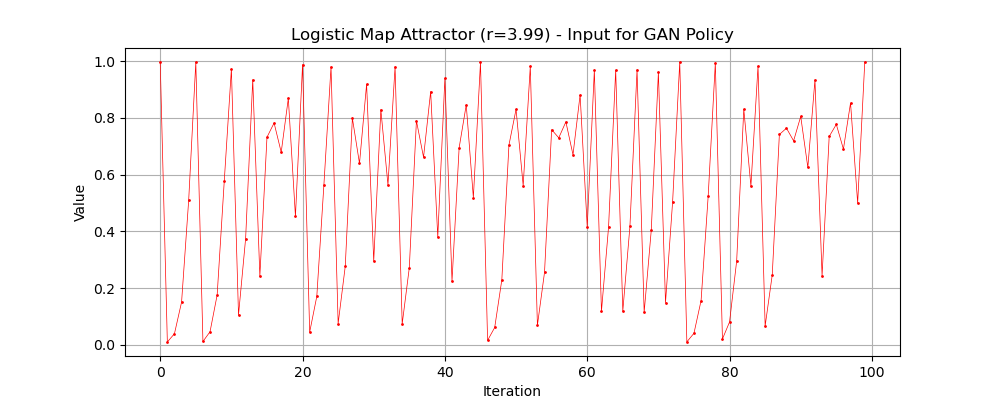
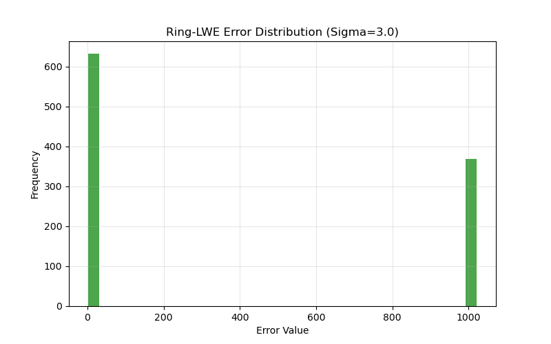
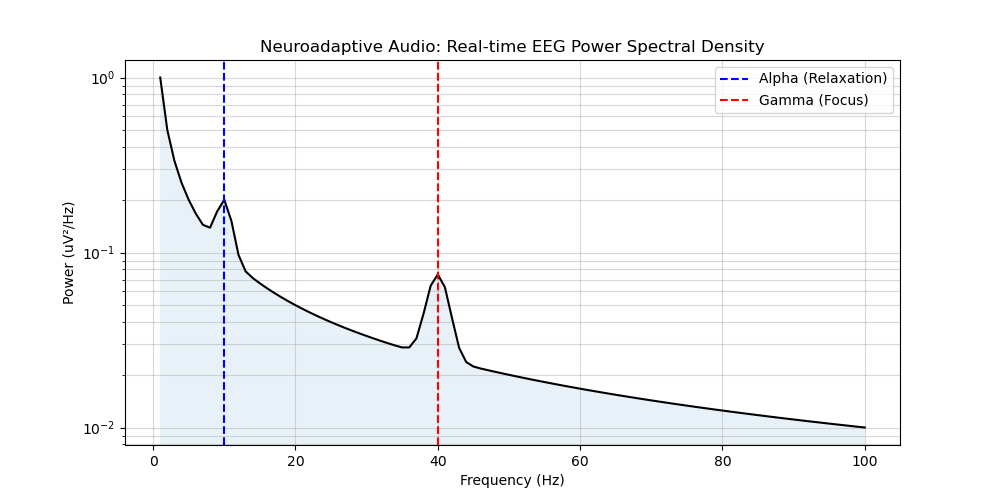
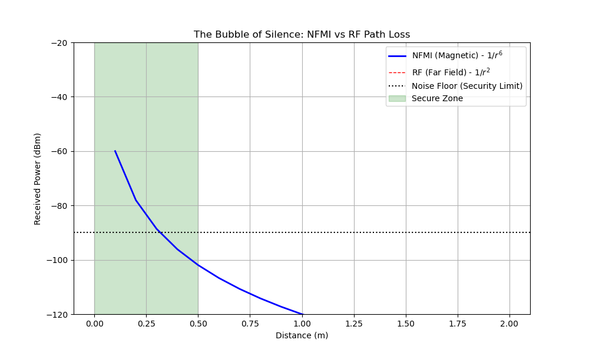
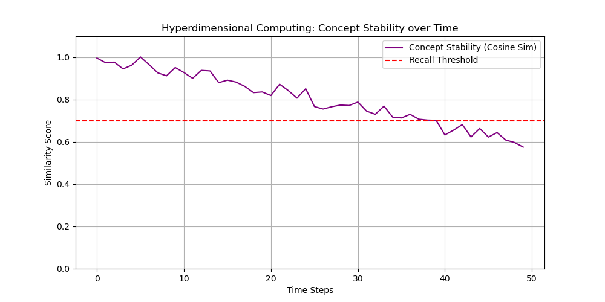
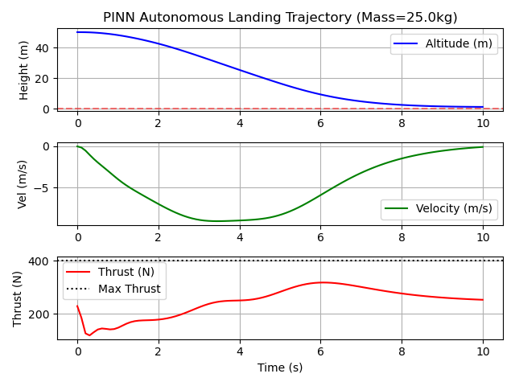

W# DAVID TOM FOSS // ADVANCED RESEARCH
## High-Assurance Systems for the Post-Quantum Era

[](https://www.linkedin.com/in/david-tom-foss)
[](mailto:contact@davidtomfoss.com)
[](./04_Technical_Reports/)
[](https://papers.ssrn.com/sol3/papers.cfm?abstract_id=5675042)

> **"Bridging the capabilities of an R&D Lab with the agility of a Solo Founder."**

This repository is the **Engineering Portfolio** of David Tom Foss. It contains **Reference Implementations**, **Simulation Environments**, and **Technical Reports** that demonstrate capability in delivering high-complexity architectures (AI Security, Neurotech, Autonomous Systems).

---

## 🏆 Published Research (Peer-Reviewed)
**[Propellant-Less Orbital Maneuvering System with Superconducting Magnet Control](https://papers.ssrn.com/sol3/papers.cfm?abstract_id=5675042)**  
*David Tom Foss (2025)*  
**Abstract**: A revolutionary system enabling theoretically unlimited satellite lifetimes via HTS magnetic coils and PINNs.  
**DOI**: `10.2139/ssrn.5675042` | **Status**: Published on SSRN

---

## 🔬 Core Research Areas

### 🛡️ Autonomous Cyberdefense & Zero-Trust
*   **[Cyberdefense Runtime](./03_Reference_Implementations/Cyberdefense_Runtime)**: Self-healing OS layer using GANs for real-time policy mutation.
    <br>
*   **[WASM Polyglot Container](./03_Reference_Implementations/WASM_Polyglot)**: Zero-Trust compute units with FHE (Homomorphic Encryption) and zk-SNARK attestation.
    <br>

### 🧠 Neuroadaptive AI & BCI
*   **[Psychoacoustic Profiler](./03_Reference_Implementations/Psychoacoustic_Profiler)**: Closed-loop auditory optimization using EEG Transformers.
    <br>
*   **[Bidirectional Silent Comm](./03_Reference_Implementations/Bidirectional_Comm_Arch)**: Subvocal communication architecture via NFMI mesh networks.
    <br>
*   **[4D Multisensory Projection](./03_Reference_Implementations/Multisensory_Projection)**: Hyperdimensional computing for cognitive data visualization.
    <br>

### 🚁 Resilient Autonomy
*   **[UAV Landing Simulation](./03_Reference_Implementations/FH-SS_UAV_Simulation)**: Physics-Informed Neural Networks (PINN) for drone landing in GPS-denied zones.
    <br>


---

## 📚 Technical Reports

We publish detailed **Technical Reports (TRs)** that bridge the gap between academic theory and codebase implementation.

| Report ID | Title | Domain | Status |
|-----------|-------|--------|--------|
| **TR-2025-01** | [Sovereign AI: Recursive Reasoning Systems](./04_Technical_Reports/TR-2025-01_Sovereign_AI.md) | AI/Legal | **Published** |
| **TR-2025-02** | [Autonomous Threat-Adaptive Cyberdefense](./04_Technical_Reports/TR-2025-02_Cyberdefense_Runtime.md) | InfoSec | **Published** |
| **TR-2025-03** | [Neuroadaptive Audio Interfaces](./04_Technical_Reports/TR-2025-03_Neuroadaptive_Audio.md) | BCI | **Published** |

---

## 🛠 Usage & Reproducibility

Each sub-directory is a self-contained MVP. To replicate our results:

```bash
# Example: Running the UAV Simulation
git clone https://github.com/DT-Foss/foss-advanced-research.git
cd foss-advanced-research/03_Reference_Implementations/FH-SS_UAV_Simulation
pip install -r requirements.txt
python simulation.py
```

## 📜 Citation

If you use this research, please cite the specific Technical Report or the Lab itself:

```yaml
authors:
  - family-names: Foss
    given-names: David Tom
title: "David Tom Foss // R&Doratory Technical Reports"
year: 2025
url: "https://github.com/DT-Foss/foss-advanced-research"
```

See [CITATION.cff](CITATION.cff) for BibTeX/APA formats.

---
**© 2025 David Tom Foss.** Released under the [MIT License](LICENSE).


---
**© 2025 David Tom Foss // R&D**
### 🔓 Open Innovation Policy
> **"Security through Obscurity is dead."**

This architecture was originally developed as a proprietary IP asset (Patent Pending). However, in light of the accelerating capabilities of AI-driven cyber threats in 2025, **David Tom Foss // R&D** has transitioned to an **Open Source / Reference Implementation** strategy ("Publish Fast" vs "Patent Slow"). 

We believe that critical defense infrastructure must be:
1.  **Transparent**: Auditable by the global security community.
2.  **Standardized**: Establishing de-facto protocols rather than walled gardens.
3.  **Resilient**: Hardened by public scrutiny (Linus's Law).

*This code is released under the MIT License to encourage rapid adoption and fork-based innovation.*
